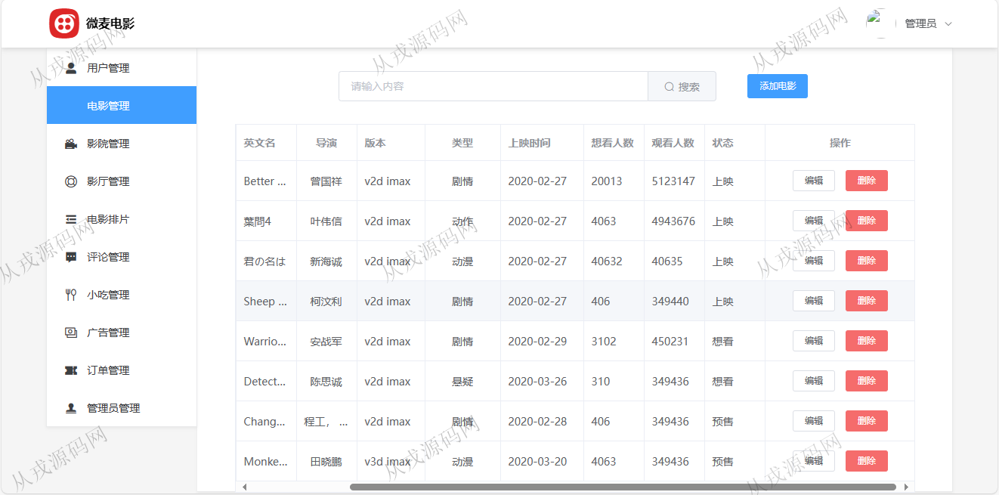
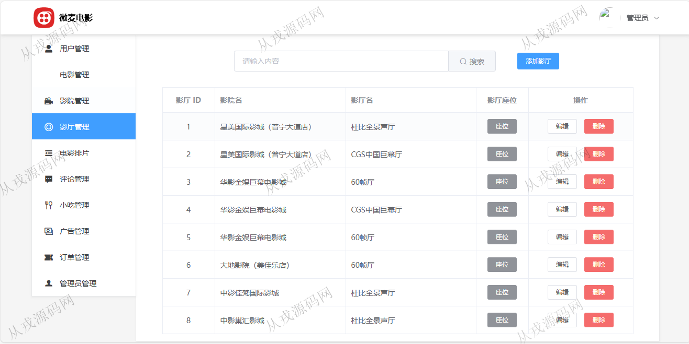
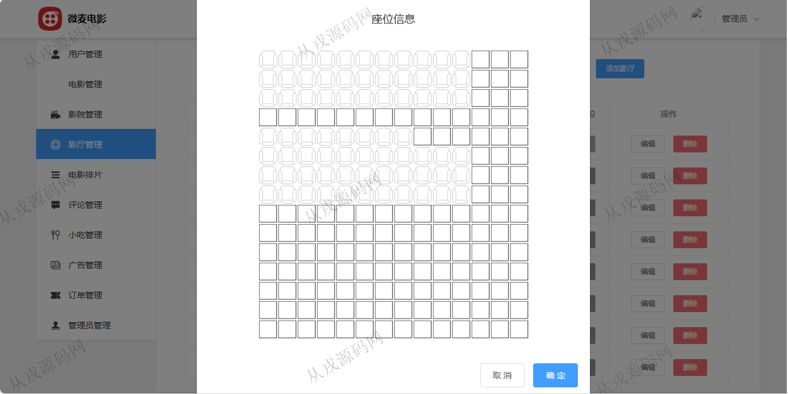
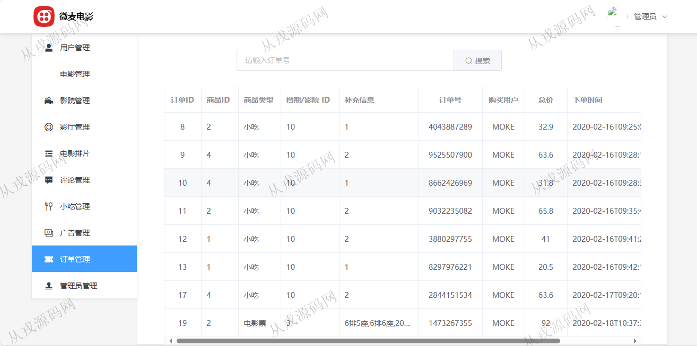
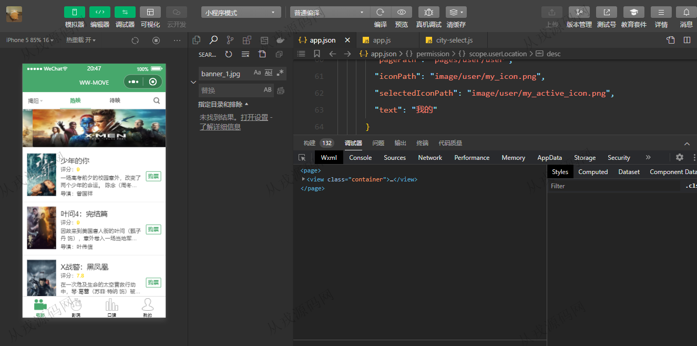
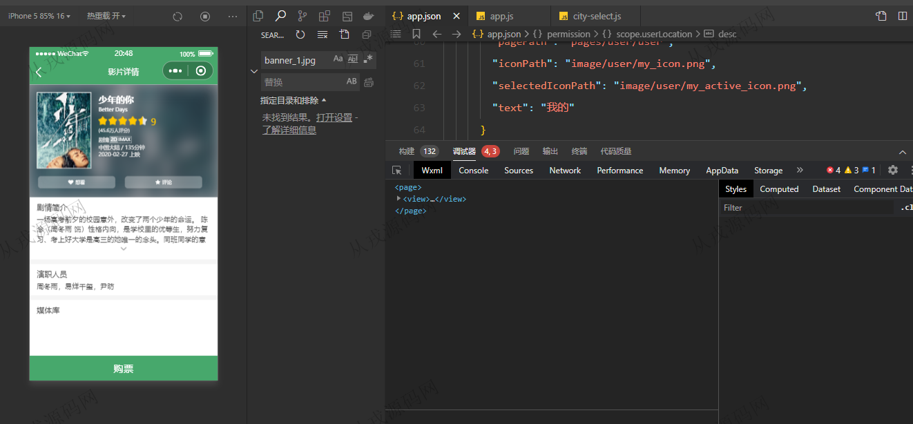
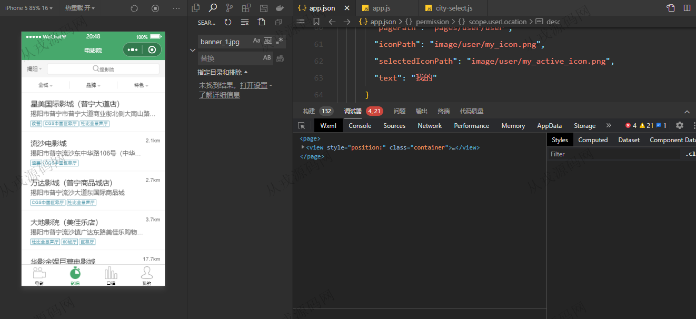
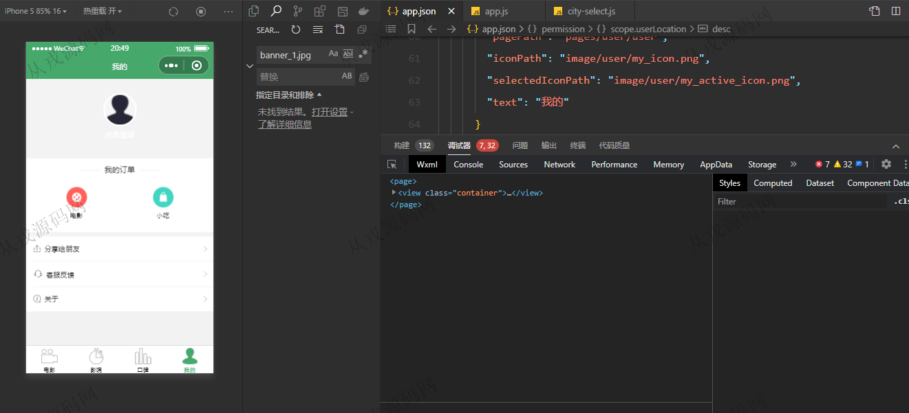

<h1 align="center">125.微麦电影购票电影院管理系统</h1>

 获取sql文件 QQ: 386869957 QQ群: 377586148 

 [推荐站点: 从戎源码网](https://armycodes.com/) 

## 简介

> 本代码来源于网络,仅供学习参考使用!
>
> 提供1.远程部署/2.修改代码/3.设计文档指导/4.框架代码讲解等服务
> 
> 访问地址：http://localhost:8080/index.html#/login
> 
> admin 123456
> 
> 

## 项目介绍
基于小程序的电影院购票管理系统【含报告】：前端 vue、elementui、小程序，后端 maven、springboot、springmvc、spring、mybatis，角色分为管理员、用户；集成小程序浏览电影，购票等功能于一体的系统。

## 功能介绍

### 管理员

- 用户管理：用户信息的列表查询，禁止和解禁
- 电影管理：电影信息的增删改查，电影海报等信息上传，模糊查询
- 影院管理：影院信息的增删改查
- 影厅管理：影厅的增删改查，座位设置
- 电影排片：添加排片，撤销排片
- 评论管理：评论信息的列表查询，评论删除
- 小吃管理：小吃信息的增删改查
- 广告管理：小程序轮播图配置列表，添加广告，编辑和删除
- 订单管理：用户在小程序购票下单，后台查询用户下单数据，可以对已下单进行撤单处理

### 用户-小程序

- 电影：电影列表展示，详情，日期选择查询电影票，购票，评论
- 影院：影院列表展示，详情，影院超值套餐，抢购，支付
- 口碑：口碑列表展示
- 我的：已购电影票查询，已购小吃查询，分享给朋友，客服反馈，关于

## 环境

- <b>IntelliJ IDEA 2021.3</b>

- <b>Mysql 5.7.26</b>

- <b>Tomcat 7.0.73</b>

- <b>JDK 1.8</b>

- <b>Redis 3.0</b>

- <b>微信小程序</b>

## 运行截图

